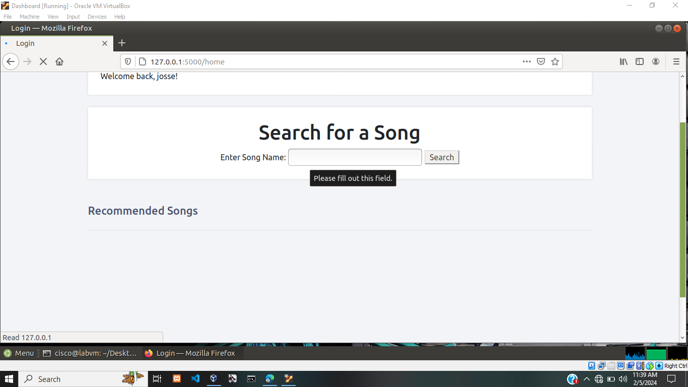
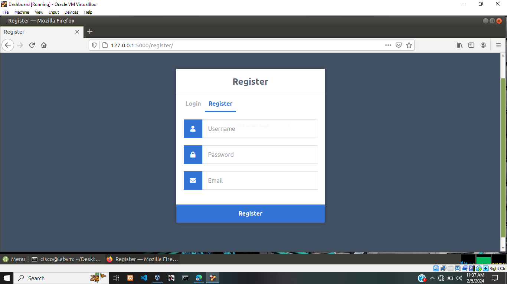
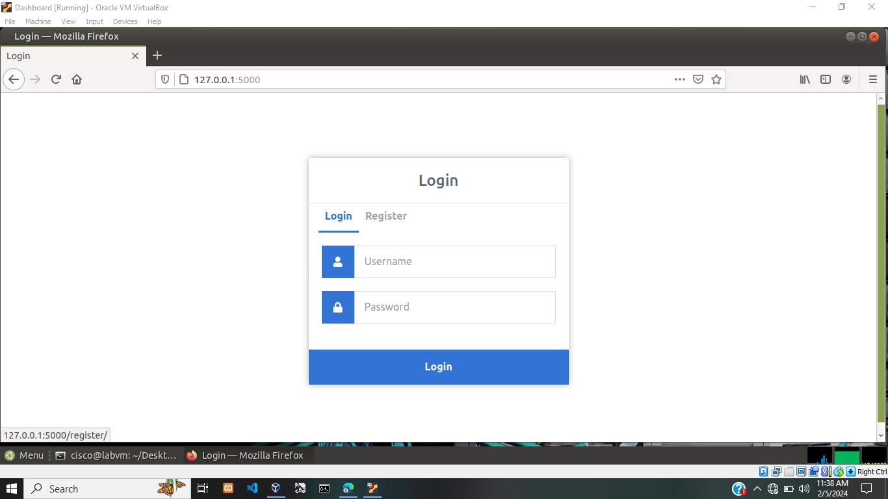

## Music-Recommendation-System-Using-Machin-Learning
Music Recommendation System Using Machin Learning

Failed to upload the model file since it to big
Main.py =====> loading songs from youtbe is hectic since most owners have blocked there songs from being played outside youtube
  

### INSTALLATION

git clone https://github.com/Neivanny1/Music_recommendation_system

cd Music_recommendation_system/auths/

pip install -r requirements.txt

 

<h1>USAGE</h1>

python3 app.py

 

### Project Demo
Home page screenshot ===========>
 

Register page screenshot ===========>
  

  

Login page screenshot ===========>
  

  

<h1>Project URL:</h1><a href = 'musicrecommendationsystems.vercel'>Click Here</a>
